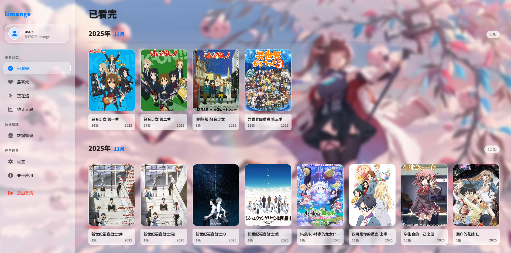
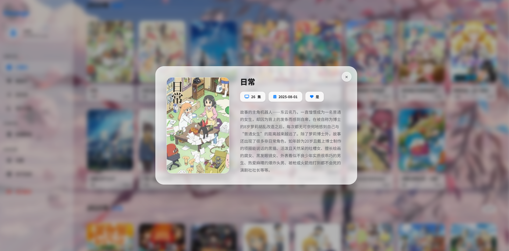
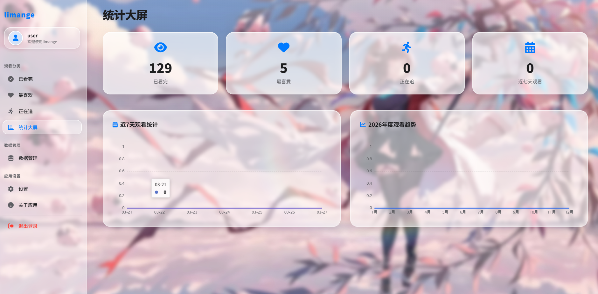
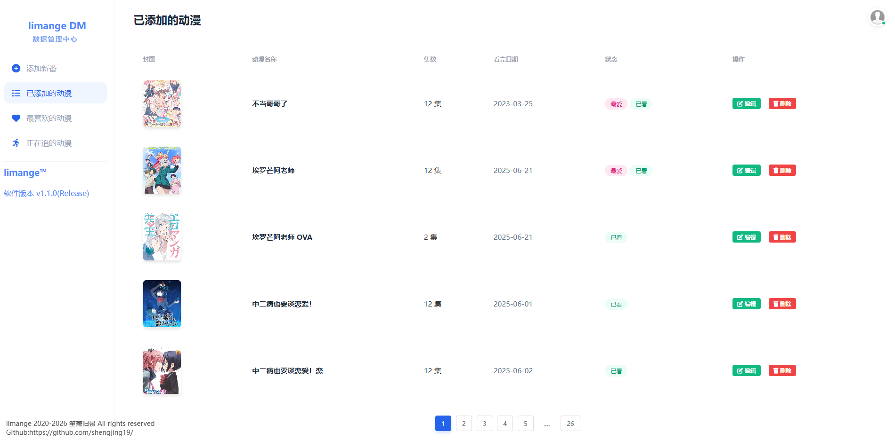
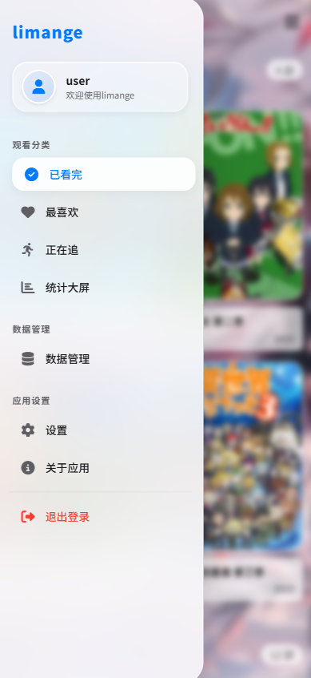

<p align="center">
  
</p>
<p align="center">limange</p>

<p align="center">
  <a href="#"></a>
  <a href="https://github.com/shengjing19/limange/releases"></a>
  <a href="https://github.com/shengjing19/limange/blob/master/LICENSE"></a>
</p>


简介
---

 limange - 个人专属追番记录库

> 前端分为两个版本
>
> 1. H5版本   当前版本号 1.1.0，此版本UI为第二版UI样式(当前最新)
>
> 2.  VUE版本 当前版本号 1.0.0，此版本UI为第一版UI样式
>
> 后端版本 1.0.0

功能与亮点
---
* 支持分类记录动漫，分为已看完、最喜欢、正在追三个板块。
* 可以在添加记录时勾选[是否最喜欢]和[是否正在追]。
* 已看完板块展示的是全部动漫记录，包含最喜欢，不包含正在追。
* 支持点击某动漫标签来展示此动漫具体信息。
* 设有添加大屏，可以查看，已看完、最喜欢、正在追、近七天观看的数据和图表统计(近7天观看统计、年度观看趋势)
* 设有数据管理，支持对数据的，增、删、改。
* 对移动端有很好的适配

使用技术
---

|前端|
|:--|
|HTML+CSS+JS或VUE|

|后端|
|:-|
|SpringBoot 3.5|

|数据库|
|:-|
|Mysql 8.0|

## 目录结构

```
.
└── NewLimange/
    ├── .idea
    ├── src
    	└── main
    		└──java
        		└── com.newlimange
            		└── config
                		└── ApplicationConfig.java
                		└── JwtAuthenticationFilter.java
                		└── SecurityConfig.java
                		└── WebConfig.java
                	└── controller
                		└── AnimeController.java
                		└── AuthController.java
                	└── dto
                		└── AnimeDTO.java
                		└── LoginRequest.java
                		└── LoginResponse.java
                		└── RegisterRequest.java
                		└── StatsDTO.java
            		└── entity
            			└── Anime.java
            			└── User.java
                	└── repository
                		└── AnimeRepository.java
                		└── UserRepository.java
                	└── service
                		└── impl
                			└── AnimeServiceImpl.java
                		└── AnimeService.java
            		└── utils
            			└── FileCheckUtil.java
            			└── JwtUtils.java
            		└── NewLimangeApplication.java
      		└── resources
      			└── application.yml
      			└── banner.txt
```

下载
---

* [下载软件最新版已编译版本](https://github.com/shengjing19/NewLimange/releases/tag/1.0.0) 
> 请注意：
>
> 提供的Releases版本需要JDK-21及其以上版本
>

图片展示
---
---
> 注意下方图片展示仅H5版本前端
>
> 登陆页面
> 
> 主页面窗口
> 
> 动漫详细窗口
> 
> 统计大屏页面
> 
> 数据管理页面
> 
>
> 移动端展示
> 		

---

一些提示
---

> 1.后端有预留注册接口，如有需要可以将硬开关设置为开，并重新编译生成
>
> 1.1.本编译版本未开启注册硬开关
>
> 1.2.提供BCrypt生成器，将你想要设置的密码输入进去，并将密文结果粘贴到数据库代码中
>
> 	
>
> 1.3.默认登录账号与密码均为user
>
> 2.[重要！！！]编译生成时注意application.yml文件的数据库和图片路径配置是否正确
>
> 3.编译生成时需保证数据库开启，编译执行期间需要数据库数据
>
> 4.重要！！！注解处理器一定要设置为从项目类路径获取
>
> 5.通过运行下载编译好的Release版本，application.yml一定放在与jar相同目录下，以便可以任意修改数据库配置或图片路径

后端运行指令
---
> java -Xms512m -Xmx1024m -jar "NewLimange-1.0.0(Release).jar"

编译以及生成
---

| 支持的编译工具：||
|:-|:-:|
| [IntelliJ IDEA] 2024.1.7 | (推荐) |

|JDK|
|:--|
|[JDK14]或以上|

许可
---

[GPL-3.0 License](https://github.com/shengjing19/limange/blob/master/LICENSE) 

